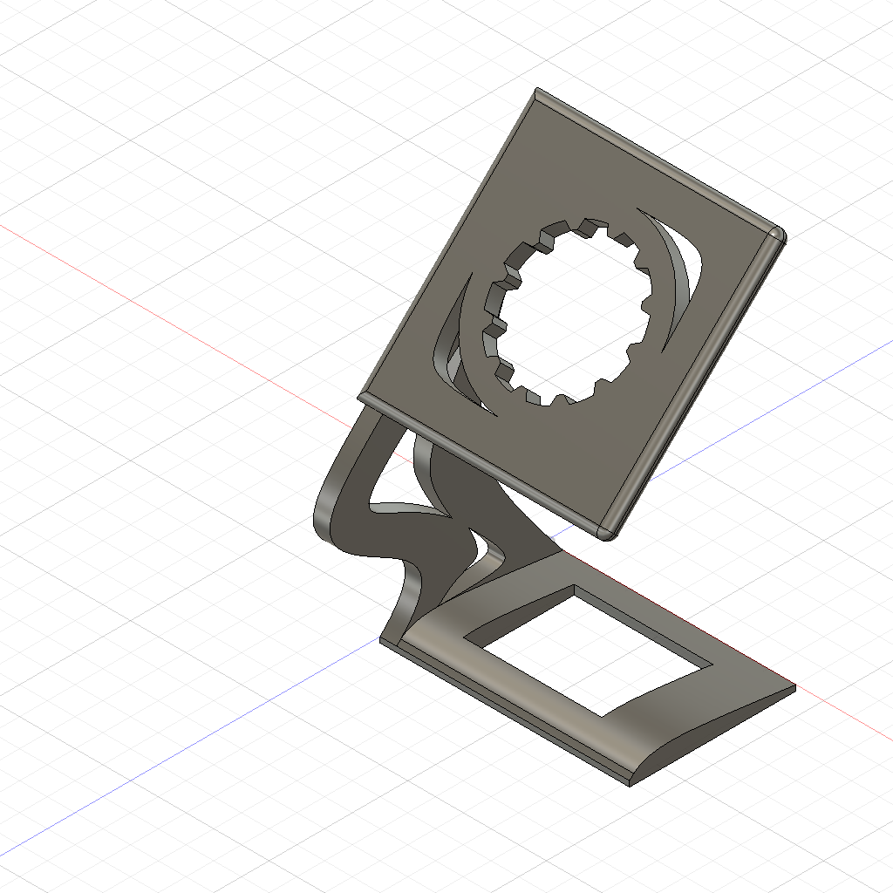
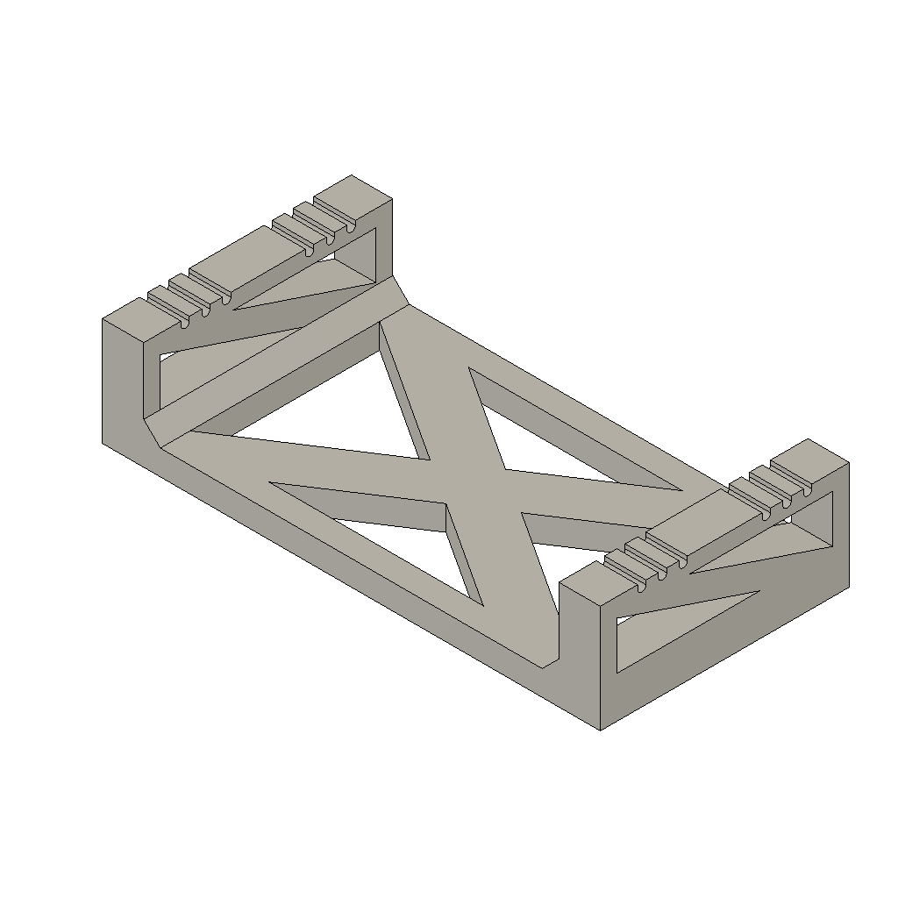
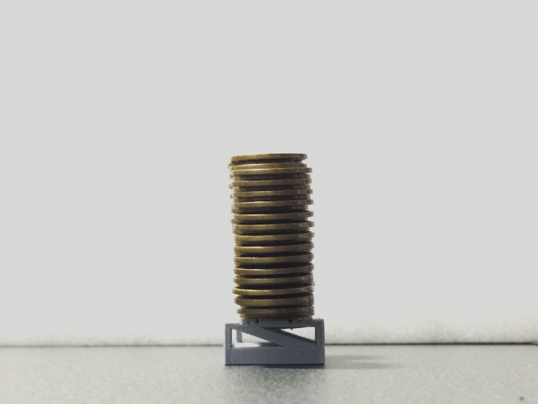
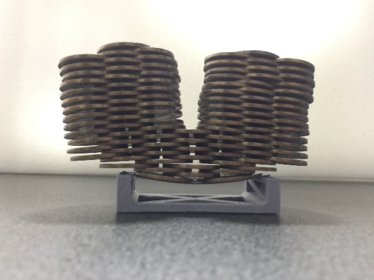

# STL_Sharing
STLファイル共有リポジトリ  
本リポジトリではCADソフトにて設計した3DモデルのSTLファイルを共有しており，3Dプリンタで作成することができます．

# 共有中のSTLファイルデータ
## 令和携帯ストラップ
STLファイルは[コチラ](./Reiwa_Phone_Strap/Reiwa_Phone_Strap.stl).  
※ストラップの紐は百円ショップ等でお買い求めください．  

## 腕時計スタンド
STLファイルは[コチラ](./Watch_Stand/watch_stand.stl).  

## 10円玉積載試験台
シャープペンシルの芯を台にセットし，どれだけ高く積み上げられるかを競ってみましょう！  
STLファイルは[コチラ](./10yen_coin_stacking_stand/10yen_coin_stacking_stand.stl).  
  
下図は筆者が10円玉を99枚積み上げた例になります．  

  
順次更新予定